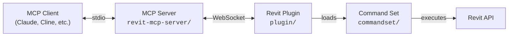

[](https://github.com/mcp-servers-for-revit/mcp-servers-for-revit)

# c# mcp-servers-for-revit

**Connect AI assistants to Autodesk Revit via the Model Context Protocol.**

mcp-servers-for-revit enables AI clients like Claude, Cline, and other MCP-compatible tools to read, create, modify, and delete elements in Revit projects. It consists of three components: a C# .NET MCP server that exposes tools to AI, a C# Revit add-in that bridges commands into Revit, and a command set that implements the actual Revit API operations.

> [!NOTE]
> This is a fork of the original [revit-mcp](https://github.com/mcp-servers-for-revit/revit-mcp) project with additional tools and functionality improvements.

## Architecture



The **MCP Server** (C#, .NET 9) translates tool calls from AI clients into WebSocket messages. The **Revit Plugin** (C#) runs inside Revit, listens for those messages, and dispatches them to the **Command Set** (C#), which executes the actual Revit API operations and returns results back up the chain.

## Requirements

- **Autodesk Revit 2020 - 2026** (any supported version)

## Quick Start (Using a Release)

1. Download the ZIP for your Revit version from the [Releases](https://github.com/mcp-servers-for-revit/mcp-servers-for-revit/releases) page (e.g., `mcp-servers-for-revit-v1.0.0-Revit2025.zip`)

2. Extract the ZIP and copy the contents to your Revit addins folder:
   ```
   %AppData%\Autodesk\Revit\Addins\<your Revit version>\
   ```
   After copying you should have:
   ```
   Addins/2025/
   ├── mcp-servers-for-revit.addin
   └── revit_mcp_plugin/
       ├── RevitMCPPlugin.dll
       ├── ...
       └── Commands/
           └── RevitMCPCommandSet/
               ├── command.json
               └── 2025/
                   ├── RevitMCPCommandSet.dll
                   └── ...
   ```

3. Configure the MCP server in your AI client (see [MCP Server Setup](#mcp-server-setup))

4. Start Revit — if prompted about an unknown add-in, click **Always Load**

5. In Revit, click the **Settings** button on the mcp-servers-for-revit ribbon tab, enable the commands you want to use, and click **Save**

## MCP Server Setup

The MCP server is a self-contained `.exe` — no runtime required. Download `RevitMcpServer.exe` from the [Releases](https://github.com/mcp-servers-for-revit/mcp-servers-for-revit/releases) page and place it anywhere on your machine.

**Claude Code**

Run this in a **terminal** (not inside Claude Code):

```bash
claude mcp add revit-mcp -- "C:\path\to\RevitMcpServer.exe"
```

**Claude Desktop**

Claude Desktop → Settings → Developer → Edit Config → `claude_desktop_config.json`:

```json
{
    "mcpServers": {
        "revit-mcp": {
            "command": "C:\\path\\to\\RevitMcpServer.exe"
        }
    }
}
```

Restart Claude Desktop. When you see the hammer icon, the MCP server is connected.


## Revit Plugin Setup

If using a release ZIP, the plugin is already included. For manual installation:

1. Build the plugin from `plugin/` (see [Development](#development))
2. Copy `mcp-servers-for-revit.addin` to `%AppData%\Autodesk\Revit\Addins\<version>\`
3. Copy the `revit_mcp_plugin/` folder to the same addins directory

## Command Set Setup

If using a release ZIP, the command set is pre-installed inside the plugin. For manual installation:

1. Build the command set from `commandset/` (see [Development](#development))
2. Inside the plugin's installation directory, create `Commands/RevitMCPCommandSet/<year>/`
3. Copy the built DLLs into that folder
4. Copy `command.json` (from repo root) into `Commands/RevitMCPCommandSet/`

## Supported Tools

### Query — Elements & Views

| Tool | Description |
| ---- | ----------- |
| `get_current_view_info` | Get current active view info |
| `get_current_view_elements` | Get elements from the current active view |
| `get_all_elements_shown_in_view` | Get all element IDs visible in a specific view |
| `get_selected_elements` | Get currently selected elements |
| `get_available_family_types` | Get available family types in current project |
| `get_elements_by_category` | Get all elements of a specific category |
| `get_elements_on_level` | Get all elements on a named level |
| `get_all_elements_of_specific_families` | Get all instances of specific families |
| `ai_element_filter` | Intelligent element querying tool for AI assistants |

### Query — Element Properties

| Tool | Description |
| ---- | ----------- |
| `get_parameters_from_elementid` | Get all parameters for elements by ID |
| `get_parameter_value_for_element_ids` | Get a single named parameter value across multiple elements |
| `get_location_for_element_ids` | Get the location (point or curve) for elements |
| `get_boundingboxes_for_element_ids` | Get the bounding box for elements |
| `get_element_types_for_element_ids` | Get the element type for each element |
| `get_object_classes_from_elementids` | Get the .NET class name for each element |
| `get_categories_from_elementids` | Get categories for a list of element IDs |

### Query — Model & Families

| Tool | Description |
| ---- | ----------- |
| `get_model_categories` | Get all categories in the model |
| `get_category_by_keyword` | Search categories by keyword |
| `get_all_used_families_in_model` | List all loaded families |
| `get_all_used_types_of_a_family` | Get all types for a specific family |
| `get_material_quantities` | Calculate material quantities and takeoffs |
| `analyze_model_statistics` | Analyze model complexity with element counts |
| `export_room_data` | Export all room data from the project |
| `get_all_warnings_in_model` | Get all warnings in the current model |

### Query — Worksets

| Tool | Description |
| ---- | ----------- |
| `get_all_workset_information` | Get all worksets in the model |
| `get_worksets_from_elementids` | Get workset assignment for elements by ID |

### Create

| Tool | Description |
| ---- | ----------- |
| `create_point_based_element` | Create point-based elements (door, window, furniture) |
| `create_line_based_element` | Create line-based elements (wall, beam, pipe) |
| `create_surface_based_element` | Create surface-based elements (floor, ceiling, roof) |
| `create_grid` | Create a grid system with smart spacing generation |
| `create_level` | Create levels at specified elevations |
| `create_room` | Create and place rooms at specified locations |
| `create_dimensions` | Create dimension annotations in the current view |
| `create_sheet` | Create sheets with a title block, number, and name |
| `create_structural_framing_system` | Create a structural beam framing system |

### Modify

| Tool | Description |
| ---- | ----------- |
| `set_parameter_value_for_elements` | Set a parameter value for multiple elements |
| `set_movement_for_elements` | Move elements by a translation vector |
| `set_rotation_for_elements` | Rotate elements around a Z axis |
| `operate_element` | Operate on elements (select, setColor, hide, isolate, etc.) |
| `delete_element` | Delete elements by ID |

### Visualisation

| Tool | Description |
| ---- | ----------- |
| `color_elements` | Color elements based on a parameter value |
| `set_graphic_overrides_for_elements_in_view` | Apply colour overrides to elements in a view |
| `set_category_visibility_in_view` | Show or hide categories in a view |
| `set_isolate_categories_in_view` | Isolate specific categories in a view |
| `set_reset_category_visibility_in_view` | Reset all category visibility overrides in a view |
| `set_isolated_elements_in_view` | Temporarily isolate specific elements in a view |
| `set_user_selection_in_revit` | Set the active selection in Revit |
| `tag_all_walls` | Tag all walls in the current view |
| `tag_all_rooms` | Tag all rooms in the current view |

### Data Storage

| Tool | Description |
| ---- | ----------- |
| `store_project_data` | Store project metadata in local database |
| `store_room_data` | Store room metadata in local database |
| `query_stored_data` | Query stored project and room data |

### Advanced

| Tool | Description |
| ---- | ----------- |
| `send_code_to_revit` | Send C# code to Revit to execute |
| `say_hello` | Display a greeting dialog in Revit (connection test) |

## Testing

The test project uses [Nice3point.TUnit.Revit](https://github.com/Nice3point/RevitUnit) to run integration tests against a live Revit instance. No separate addin installation is required — the framework injects into the running Revit process automatically.

### Prerequisites

- **.NET 10 SDK** — required by Nice3point.Revit.Sdk 6.1.0. Install via `winget install Microsoft.DotNet.SDK.10`
- **Autodesk Revit 2026** (or 2025) — must be installed and licensed on your machine

### Running Tests

1. Open Revit 2026 (or 2025) and wait for it to fully load
2. Run the tests from the command line:

```bash
# For Revit 2026
dotnet test -c Debug.R26 -r win-x64 tests/commandset

# For Revit 2025
dotnet test -c Debug.R25 -r win-x64 tests/commandset
```

> **Note:** The `-r win-x64` flag is required on ARM64 machines because the Revit API assemblies are x64-only.

Alternatively, you can use `dotnet run`:

```bash
cd tests/commandset
dotnet run -c Debug.R26
```

### IDE Support

- **JetBrains Rider** — enable "Testing Platform support" in Settings > Build, Execution, Deployment > Unit Testing > Testing Platform
- **Visual Studio** — tests should be discoverable through the standard Test Explorer

### Test Structure

| Directory | Purpose |
|-----------|---------|
| `tests/commandset/AssemblyInfo.cs` | Global `[assembly: TestExecutor<RevitThreadExecutor>]` registration |
| `tests/commandset/Architecture/` | Tests for level and room creation commands |
| `tests/commandset/DataExtraction/` | Tests for model statistics, room data export, and material quantities |
| `tests/commandset/ColorSplashTests.cs` | Tests for color override functionality |
| `tests/commandset/TagRoomsTests.cs` | Tests for room tagging functionality |

### Writing New Tests

Test classes inherit from `RevitApiTest` and use TUnit's async assertion API:

```csharp
public class MyTests : RevitApiTest
{
    private static Document _doc;

    [Before(HookType.Class)]
    [HookExecutor<RevitThreadExecutor>]
    public static void Setup()
    {
        _doc = Application.NewProjectDocument(UnitSystem.Imperial);
    }

    [After(HookType.Class)]
    [HookExecutor<RevitThreadExecutor>]
    public static void Cleanup()
    {
        _doc?.Close(false);
    }

    [Test]
    public async Task MyTest_Condition_ExpectedResult()
    {
        var elements = new FilteredElementCollector(_doc)
            .WhereElementIsNotElementType()
            .ToElements();

        await Assert.That(elements.Count).IsGreaterThan(0);
    }
}
```

## Development

### MCP Server

```bash
cd revit-mcp-server
dotnet publish -c Release -r win-x64 --self-contained true -p:PublishSingleFile=true
```

Output: `revit-mcp-server\bin\Release\net9.0\win-x64\publish\RevitMcpServer.exe` — a single self-contained executable, no .NET runtime required on the target machine.

### Revit Plugin + Command Set

Open `mcp-servers-for-revit.sln` in Visual Studio. The solution contains both the plugin and command set projects. Build configurations target Revit 2020-2026:

- **Revit 2020-2024**: .NET Framework 4.8 (`Release R20` through `Release R24`)
- **Revit 2025-2026**: .NET 8 (`Release R25`, `Release R26`)

Building the solution automatically assembles the complete deployable layout in `plugin/bin/AddIn <year> <config>/` - the command set is copied into the plugin's `Commands/` folder as part of the build.

## Building for Release

### C# MCP Server

```bash
cd revit-mcp-server
dotnet publish -c Release -r win-x64 --self-contained true -p:PublishSingleFile=true
```

| Output | Location |
|--------|----------|
| `RevitMcpServer.exe` | `revit-mcp-server\bin\Release\net9.0\win-x64\publish\` |

### Revit Plugin + Command Set

Each Revit version has its own release configuration. Run from the repo root (or open in Visual Studio and select the configuration):

```bash
# Revit 2020 (.NET 4.8)
dotnet build mcp-servers-for-revit.sln -c "Release R20"

# Revit 2021 (.NET 4.8)
dotnet build mcp-servers-for-revit.sln -c "Release R21"

# Revit 2022 (.NET 4.8)
dotnet build mcp-servers-for-revit.sln -c "Release R22"

# Revit 2023 (.NET 4.8)
dotnet build mcp-servers-for-revit.sln -c "Release R23"

# Revit 2024 (.NET 4.8)
dotnet build mcp-servers-for-revit.sln -c "Release R24"

# Revit 2025 (.NET 8)
dotnet build mcp-servers-for-revit.sln -c "Release R25"

# Revit 2026 (.NET 8)
dotnet build mcp-servers-for-revit.sln -c "Release R26"
```

Each build produces a ready-to-deploy addin layout at:

```
plugin\bin\AddIn <year> Release R<xx>\
├── mcp-servers-for-revit.addin
└── revit_mcp_plugin\
    ├── RevitMCPPlugin.dll
    └── Commands\
        └── RevitMCPCommandSet\
            ├── command.json
            └── <year>\
                └── RevitMCPCommandSet.dll
```

Copy the contents of that folder to `%AppData%\Autodesk\Revit\Addins\<year>\` to deploy.

## Project Structure

```
mcp-servers-for-revit/
├── mcp-servers-for-revit.sln    # Combined solution (plugin + commandset + tests)
├── command.json                 # Command set manifest
├── revit-mcp-server/            # MCP server (C#, .NET 9) - tools exposed to AI clients
├── plugin/                      # Revit add-in (C#) - WebSocket bridge inside Revit
├── commandset/                  # Command implementations (C#) - Revit API operations
├── tests/                       # Integration tests (C#) - TUnit tests against live Revit
├── assets/                      # Images for documentation
├── .github/                     # CI/CD workflows, contributing guide, code of conduct
├── LICENSE
└── README.md
```

## Releasing

A single `v*` tag drives the entire release. The [release workflow](.github/workflows/release.yml) automatically:

- Builds `RevitMcpServer.exe` (self-contained, no runtime required)
- Builds the Revit plugin + command set for Revit 2020-2026
- Creates a GitHub release with:
  - `RevitMcpServer.exe` as a standalone asset
  - `mcp-servers-for-revit-vX.Y.Z-Revit<year>.zip` assets for each Revit version

To create a release:

1. Run the bump script (updates `plugin/Properties/AssemblyInfo.cs`, then commits and tags):
   ```powershell
   ./scripts/release.ps1 -Version X.Y.Z
   ```

2. Push to trigger the workflow:
   ```bash
   git push origin main --tags
   ```

## Acknowledgements

This project is a fork of the work by the [mcp-servers-for-revit](https://github.com/mcp-servers-for-revit) team. The original repositories:

- [revit-mcp](https://github.com/mcp-servers-for-revit/revit-mcp) - MCP server
- [revit-mcp-plugin](https://github.com/mcp-servers-for-revit/revit-mcp-plugin) - Revit plugin
- [revit-mcp-commandset](https://github.com/mcp-servers-for-revit/revit-mcp-commandset) - Command set

Thank you to the original authors for creating the foundation that this project builds upon.

A number of the additional tools added in this project were inspired by [revit-claude-mcp](https://github.com/IbrahimFahdah/revit-claude-mcp) by Ibrahim Fahdah. Thank you for sharing that work openly.

## License

[MIT](LICENSE)
