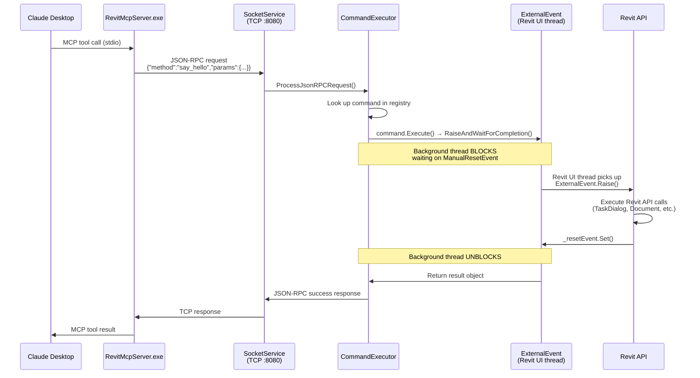

# Revit MCP Plugin

A Revit add-in that exposes a JSON-RPC TCP server on `localhost:8080`, allowing external processes to execute Revit API commands safely from a background connection.

## Prerequisites

| Requirement | Version |
|---|---|
| Autodesk Revit | 2020 – 2026 |
| .NET Framework | 4.8 (Revit 2020–2024) or .NET 8 (Revit 2025–2026) |

## Installation

1. Build the solution for your Revit version (e.g. `Debug R25|Any CPU`).
2. Copy the output files to your Revit add-ins folder:
   ```
   %APPDATA%\Autodesk\Revit\Addins\2025\
   ```
3. Place `mcp-servers-for-revit.addin` and the `revit_mcp_plugin\` folder (containing `RevitMCPPlugin.dll` and the `Commands\` subdirectory) in that directory.
4. Ensure `command.json` is present in `Commands/RevitMCPCommandSet/` (see `PathManager.cs` for the resolved path).
5. Start Revit — the **Revit MCP Plugin** ribbon panel will appear.
6. Click **Revit MCP Switch** to start the TCP server.

## How It Works

The plugin bridges Claude (via the MCP server) to the Revit API. Because Revit's API is UI-thread-only, every command goes through Revit's **External Event** mechanism.



### Key Components

| File | Responsibility |
|---|---|
| `Core/Application.cs` | `IExternalApplication` entry point; creates ribbon buttons; stops server on shutdown |
| `Core/SocketService.cs` | `TcpListener` on port 8080; accepts connections; routes JSON-RPC requests |
| `Core/CommandManager.cs` | Loads command assemblies listed in `command.json` at startup |
| `Core/CommandExecutor.cs` | Looks up the right `IRevitCommand` by method name and calls `Execute()` |
| `Core/ExternalEventManager.cs` | Creates and caches `ExternalEvent` instances (must be created on the UI thread) |
| `commandset/Commands/*/` | One class per command — parses params, sets up handler, raises the event, waits |
| `commandset/Services/*/` | `IExternalEventHandler` implementations — the **only** place Revit API calls are legal |

### Why External Events?

Revit's API can only be called from the **UI thread**. The TCP socket runs on a background thread. The External Event pattern works like this:

1. The command sets its parameters on the event handler.
2. It calls `ExternalEvent.Raise()` and then **blocks** on a `ManualResetEvent` (15–30 second timeout).
3. Revit picks up the event between its own UI ticks and calls `handler.Execute(UIApplication)`.
4. The handler performs the Revit API work, then signals the reset event.
5. The background thread unblocks and returns the result over TCP.

## Available Commands

### Query — Elements & Views

| Command | Description |
|---|---|
| `get_current_view_info` | Get current active view info |
| `get_current_view_elements` | Get elements from the current active view |
| `get_all_elements_shown_in_view` | Get all element IDs visible in a specific view |
| `get_selected_elements` | Get currently selected elements |
| `get_available_family_types` | Get available family types in current project |
| `get_elements_by_category` | Get all elements of a specific category |
| `get_elements_on_level` | Get all elements on a named level |
| `get_all_elements_of_specific_families` | Get all instances of specific families |
| `ai_element_filter` | Intelligent element querying tool for AI assistants |

### Query — Element Properties

| Command | Description |
|---|---|
| `get_parameters_from_elementid` | Get all parameters for elements by ID |
| `get_parameter_value_for_element_ids` | Get a single named parameter value across multiple elements |
| `get_location_for_element_ids` | Get the location (point or curve) for elements |
| `get_boundingboxes_for_element_ids` | Get the bounding box for elements |
| `get_element_types_for_element_ids` | Get the element type for each element |
| `get_object_classes_from_elementids` | Get the .NET class name for each element |
| `get_categories_from_elementids` | Get categories for a list of element IDs |

### Query — Model & Families

| Command | Description |
|---|---|
| `get_model_categories` | Get all categories in the model |
| `get_category_by_keyword` | Search categories by keyword |
| `get_all_used_families_in_model` | List all loaded families |
| `get_all_used_types_of_a_family` | Get all types for a specific family |
| `get_material_quantities` | Calculate material quantities and takeoffs |
| `analyze_model_statistics` | Analyze model complexity with element counts |
| `export_room_data` | Export all room data from the project |
| `get_all_warnings_in_model` | Get all warnings in the current model |

### Query — Worksets

| Command | Description |
|---|---|
| `get_all_workset_information` | Get all worksets in the model |
| `get_worksets_from_elementids` | Get workset assignment for elements by ID |

### Create

| Command | Description |
|---|---|
| `create_point_based_element` | Create point-based elements (door, window, furniture) |
| `create_line_based_element` | Create line-based elements (wall, beam, pipe) |
| `create_surface_based_element` | Create surface-based elements (floor, ceiling, roof) |
| `create_grid` | Create a grid system with smart spacing generation |
| `create_level` | Create levels at specified elevations |
| `create_room` | Create and place rooms at specified locations |
| `create_dimensions` | Create dimension annotations in the current view |
| `create_sheet` | Create sheets with a title block, number, and name |
| `create_structural_framing_system` | Create a structural beam framing system |

### Modify

| Command | Description |
|---|---|
| `set_parameter_value_for_elements` | Set a parameter value for multiple elements |
| `set_movement_for_elements` | Move elements by a translation vector |
| `set_rotation_for_elements` | Rotate elements around a Z axis |
| `operate_element` | Operate on elements (select, setColor, hide, isolate, etc.) |
| `delete_element` | Delete elements by ID |

### Visualisation

| Command | Description |
|---|---|
| `color_splash` | Colour elements by parameter value |
| `set_graphic_overrides_for_elements_in_view` | Apply colour overrides to elements in a view |
| `set_category_visibility_in_view` | Show or hide categories in a view |
| `set_isolate_categories_in_view` | Isolate specific categories in a view |
| `set_reset_category_visibility_in_view` | Reset all category visibility overrides in a view |
| `set_isolated_elements_in_view` | Temporarily isolate specific elements in a view |
| `set_user_selection_in_revit` | Set the active selection in Revit |
| `tag_walls` | Tag all walls in the current view |
| `tag_rooms` | Tag all rooms in the current view |

### Advanced

| Command | Description |
|---|---|
| `send_code_to_revit` | Execute dynamic C# code with full Revit API access |
| `say_hello` | Display a greeting dialog in Revit (connection test) |

## Port Configuration

The TCP server is hardcoded to port `8080` in `Core/SocketService.cs`. To change it, update that line and rebuild. The MCP server must be configured with the same port via the `REVIT_PLUGIN_PORT` environment variable.
