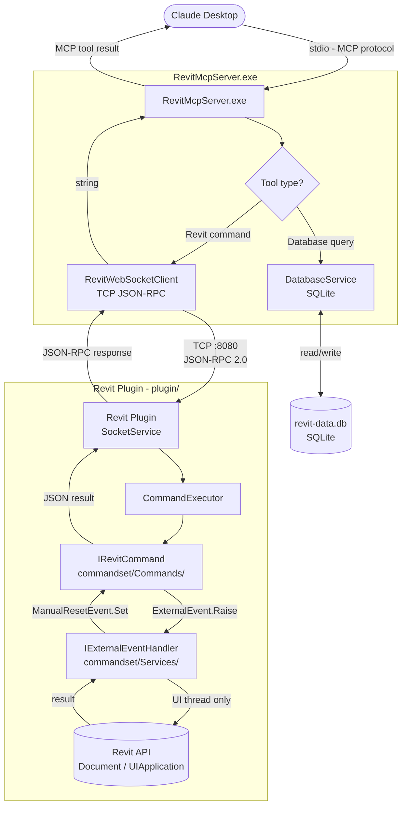

# RevitMcpServer

A .NET 9 MCP (Model Context Protocol) server that connects Claude Desktop to a running Revit instance. It communicates with Claude over **stdio** and relays tool calls to the Revit plugin over **TCP JSON-RPC**.

This is a C# replacement for the original TypeScript `server/` implementation, offering the same tool surface with a single self-contained executable — no Node.js runtime required.

## Prerequisites

| Requirement | Detail |
|---|---|
| .NET 9 SDK | For building |
| Revit MCP Plugin | Must be running in Revit (see `plugin/README.md`) |
| Claude Desktop | [claude.ai/download](https://claude.ai/download) |

## Build

```bash
cd revit-mcp-server
dotnet publish -c Release -r win-x64 --self-contained true -p:PublishSingleFile=true
```

Output: `bin\Release\net9.0\win-x64\publish\RevitMcpServer.exe`

A single file with no external runtime dependency.

## Claude Desktop Configuration

Edit `%APPDATA%\Claude\claude_desktop_config.json`:

```json
{
  "mcpServers": {
    "revit-mcp": {
      "command": "C:\\path\\to\\revit-mcp-server\\bin\\Release\\net9.0\\win-x64\\publish\\RevitMcpServer.exe",
      "env": {
        "REVIT_PLUGIN_PORT": "8080"
      }
    }
  }
}
```

Set `REVIT_PLUGIN_PORT` to match the port configured in the Revit plugin (`plugin/Core/SocketService.cs`).

## How It Works



### Request lifecycle

1. Claude calls a tool (e.g. `create_room`) over stdio using the MCP protocol.
2. `RevitToolsHandler` receives the call; parameters are automatically deserialized from JSON by the MCP SDK.
3. For Revit tools: `RevitWebSocketClient` serialises a **JSON-RPC 2.0** request and sends it over TCP to the plugin.
4. The plugin's `SocketService` receives the request on a background thread and routes it to the matching `IRevitCommand`.
5. The command marshals the call to Revit's UI thread via an `ExternalEvent`, waits for completion (up to 30 s), and returns the result.
6. The JSON response travels back over TCP → `RevitWebSocketClient` → `RevitToolsHandler` → Claude.
7. For database tools (`store_project_data`, `store_room_data`, `query_stored_data`): `DatabaseService` reads/writes a local SQLite file (`revit-data.db`) directly — no Revit call is made.

### Protocol

```
TCP message (request):
{
  "jsonrpc": "2.0",
  "method":  "create_room",
  "params":  { "data": [ { "name": "Office", ... } ] },
  "id":      "550e8400-e29b-41d4-a716-446655440000"
}

TCP message (response — success):
{
  "id":     "550e8400-e29b-41d4-a716-446655440000",
  "result": { "success": true, ... }
}

TCP message (response — error):
{
  "id":    "550e8400-e29b-41d4-a716-446655440000",
  "error": { "code": -32603, "message": "Wall host not found" }
}
```

## Project Structure

```
revit-mcp-server/
├── Program.cs                      # Host setup, DI registration
├── RevitMcpServer.csproj
├── Tools/
│   └── RevitToolsHandler.cs        # All MCP tools ([McpServerToolType])
├── WebSocket/
│   └── RevitWebSocketClient.cs     # TCP client; lazy connect; auto-reconnect
├── Models/
│   ├── RevitCommand.cs             # JSON-RPC request DTO
│   └── RevitResponse.cs            # JSON-RPC response DTO
└── Database/
    └── DatabaseService.cs          # SQLite for project/room metadata
```

## Available Tools (54)

### Query — Elements & Views

| Tool | Description |
|---|---|
| `say_hello` | Test the connection — shows a dialog in Revit |
| `get_current_view_info` | Active view type, name, scale |
| `get_current_view_elements` | Elements in the active view, filterable by category |
| `get_all_elements_shown_in_view` | All element IDs visible in a specific view |
| `get_selected_elements` | Currently selected elements |
| `get_available_family_types` | Family types in the project, filterable |
| `get_elements_by_category` | All elements of a specific category by ID |
| `get_elements_on_level` | All elements on a named level, with optional category filter |
| `get_all_elements_of_specific_families` | All placed instances of specific families |
| `ai_element_filter` | Query elements by category, type, bounding box, visibility |

### Query — Element Properties

| Tool | Description |
|---|---|
| `get_parameters_from_elementid` | All parameters for elements by ID, with optional name filter |
| `get_parameter_value_for_element_ids` | A single named parameter value across multiple elements |
| `get_location_for_element_ids` | Location (point or curve) for elements |
| `get_boundingboxes_for_element_ids` | Bounding box min/max for elements |
| `get_element_types_for_element_ids` | Element type (TypeId and type name) per element |
| `get_object_classes_from_elementids` | .NET class name for each element |
| `get_categories_from_elementids` | Categories for a list of element IDs |

### Query — Model & Families

| Tool | Description |
|---|---|
| `get_model_categories` | All categories in the model |
| `get_category_by_keyword` | Search categories by keyword |
| `get_all_used_families_in_model` | All loaded families |
| `get_all_used_types_of_a_family` | All types for a specific family |
| `get_material_quantities` | Material takeoffs by category |
| `analyze_model_statistics` | Element counts by category, family, level |
| `export_room_data` | Full room schedule with area, volume, perimeter |
| `get_all_warnings_in_model` | All warnings in the current model |

### Query — Worksets

| Tool | Description |
|---|---|
| `get_all_workset_information` | All worksets in the model |
| `get_worksets_from_elementids` | Workset assignment for elements by ID |

### Create

| Tool | Description |
|---|---|
| `create_level` | Create levels with optional plan views |
| `create_grid` | Create a named grid system |
| `create_room` | Place rooms inside enclosed wall boundaries |
| `create_line_based_element` | Create walls, beams, pipes (batch) |
| `create_point_based_element` | Create doors, windows, furniture (batch) |
| `create_surface_based_element` | Create floors, ceilings, roofs (batch) |
| `create_sheet` | Create sheets with a title block, number, and name |
| `create_structural_framing_system` | Create a beam framing system |
| `create_dimensions` | Create dimension annotations |

### Modify

| Tool | Description |
|---|---|
| `set_parameter_value_for_elements` | Set a parameter value for multiple elements |
| `set_movement_for_elements` | Move elements by a translation vector |
| `set_rotation_for_elements` | Rotate elements around a Z axis |
| `operate_element` | Select, colour, hide, isolate, or highlight elements |
| `delete_element` | Delete elements by ID |

### Visualisation

| Tool | Description |
|---|---|
| `color_elements` | Colour elements by parameter value |
| `set_graphic_overrides_for_elements_in_view` | Apply colour overrides to elements in a view |
| `set_category_visibility_in_view` | Show or hide categories in a view |
| `set_isolate_categories_in_view` | Isolate specific categories in a view |
| `set_reset_category_visibility_in_view` | Reset all category visibility overrides |
| `set_isolated_elements_in_view` | Temporarily isolate specific elements in a view |
| `set_user_selection_in_revit` | Set the active selection in Revit |
| `tag_all_rooms` | Tag all rooms in the active view |
| `tag_all_walls` | Tag all walls in the active view |

### Advanced

| Tool | Description |
|---|---|
| `send_code_to_revit` | Execute dynamic C# code with full Revit API access |

### Local Database

| Tool | Description |
|---|---|
| `store_project_data` | Save project metadata to local SQLite |
| `store_room_data` | Save room data linked to a project |
| `query_stored_data` | Query projects, rooms, or database stats |
